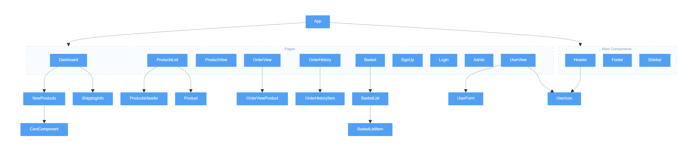

# Bob-s-Beagles-FE

Frontend of the Bob's Beagles Ecommerce App

## React + Vite

This template provides a minimal setup to get React working in Vite with HMR and some ESLint rules.

Currently, two official plugins are available:

- [@vitejs/plugin-react](https://github.com/vitejs/vite-plugin-react/blob/main/packages/plugin-react/README.md) uses [Babel](https://babeljs.io/) for Fast Refresh
- [@vitejs/plugin-react-swc](https://github.com/vitejs/vite-plugin-react-swc) uses [SWC](https://swc.rs/) for Fast Refresh

## Sources

Icons: Tabler

Components: Mantine

## Documentation

### Component tree



### User Stories

```
1.
As a member of the public,
so that I can feed my pet,
I want to add pet food to my basket.
```

```
2.
As a customer,
So I know how much money I need,
I'd like to know the total cost of products in my basket.
```

```
3.
As a customer,
So I can change my order,
I'd like to remove a product from my basket.
```

```
4.
As a customer,
to make the order process faster,
I want to create an account.
```

```
5.
As a customer,
so I can move to a new house,
I want to be able to edit my user details.
```

```
6.
As a customer,
because I am impatient,
I want to see the status of my order.
```

```
7.
As a customer,
so I can keep track of my spendings,
I want to see my order history.
```

```
8.
As a customer,
so that I can decide what to order,
I want to be able to view detailed information about the products.
```

```
9.
As the manager,
so that I can display information about the business and new products,
I want to have a fresh and fancy dashboard page.
```

### Pages

- Dashboard: `/`
- ProductsList: `/products`
- ProductView: `/products/:id`
- OrderView: `/users/:id/orders/:orderId`
- OrderHistory: `/users/:id/orders`
- Basket: `/basket`
- Signup: `/signup`
- Login: `/login`
- Admin: `/admin`
- UserView: `/users/:id`
